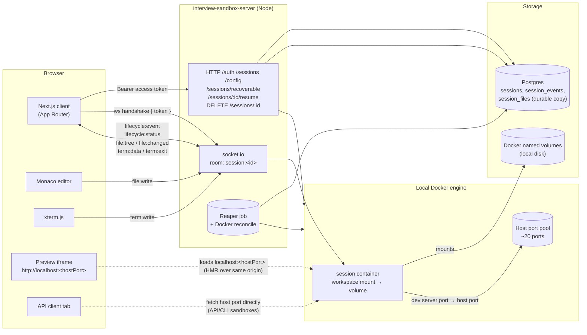
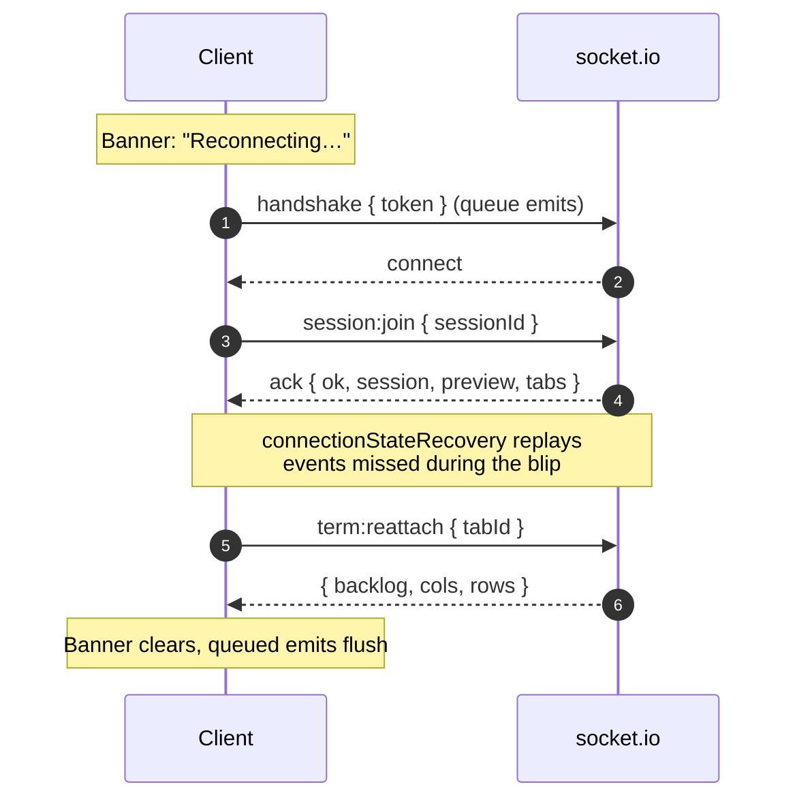
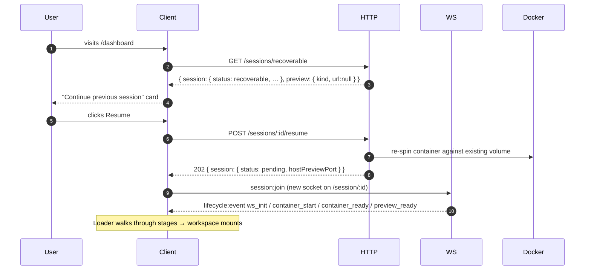

# interview-sandbox-client

Web client for the technical-interview sandbox platform. Separate repo from
the server; talks to it over HTTP + socket.io.

## Stack

- Next.js (App Router) + TypeScript (strict)
- Tailwind CSS v4 + shadcn/ui (base preset)
- Dark mode only — no theme toggle
- Realtime: socket.io-client
- Editor: Monaco (`@monaco-editor/react`)
- Terminal: xterm.js (`@xterm/xterm` + `@xterm/addon-fit`)
- Tests: Playwright (E2E) — browsers via `pnpm test:e2e:install`
- pnpm

## Getting started

```bash
pnpm install
cp .env.local.example .env.local   # adjust if the server isn't on :4000
pnpm dev
```

Open <http://localhost:3000>.

| Command | What it does |
| --- | --- |
| `pnpm dev` | Start Next dev server |
| `pnpm build` | Production build |
| `pnpm typecheck` | `tsc --noEmit` |
| `pnpm lint` | ESLint (next config) |
| `pnpm format` | Prettier write |
| `pnpm test:e2e` | Run Playwright E2E suite (needs running server + creds) |
| `pnpm test:e2e:install` | One-time Chromium download for Playwright |

## Environment

| Var | Default | Purpose |
| --- | --- | --- |
| `NEXT_PUBLIC_API_URL` | `http://localhost:4000` | Server HTTP base |
| `NEXT_PUBLIC_WS_URL`  | `http://localhost:4000` | socket.io URL |
| `E2E_BASE_URL` | `http://localhost:3000` | Target for the E2E suite |
| `E2E_USER_EMAIL` | — | Seeded credentials for the suite |
| `E2E_USER_PASSWORD` | — | Seeded credentials for the suite |

## Architecture



### Reconnect path (socket blip)



### Resume path (recoverable session)



## Server-owned config contract

The server is the **single source of truth** for the framework / customization
config. The client fetches it from `GET /config/frameworks` rather than
hard-coding the option set. Request and response shapes live in
[`src/types/api.ts`](src/types/api.ts) and are kept in sync by hand for v1.

## Auth model

Bearer auth — every request carries `Authorization: Bearer <accessToken>`.
The token is held in `localStorage` under `isb.accessToken` with an in-memory
cache (see [`src/lib/auth/token-store.ts`](src/lib/auth/token-store.ts)). All
token reads/writes go through that one module; nothing else touches storage.

On a non-`/auth/*` 401 the API client does a one-shot silent
`/auth/refresh` (coalesced across concurrent 401s) and retries the original
request. Hard refresh failure bounces the user to `/login`.

## Folder layout

```
src/
  app/
    (protected)/        Auth-gated route group: dashboard, session, admin
    error.tsx           Per-segment error boundary
    global-error.tsx    Root-layout fallback (renders own <html>/<body>)
    login/              Public login page
  components/
    ui/                 shadcn primitives (generated; rerun `shadcn add` to update)
    feature/            Composed feature components
      session/          Workspace pieces (file tree, editor, terminal, browser, api client)
  lib/
    api.ts              Typed fetch wrapper (Bearer, silent-refresh, error toasts)
    socket.ts           Session socket: reconnect, queue, refresh+rehandshake
    auth/
      auth-context.tsx  React context for User + login/logout/refresh
      token-store.ts    The only legal place that reads/writes the access token
    hooks/              Feature hooks (use-workspace, use-api-client, …)
    server-preview.ts   ServerPreview → client PreviewInfo mapper
  types/
    api.ts              Hand-maintained HTTP contract shapes
    api-client.ts       API-client tab state
    session.ts          Socket contract shapes (FileChangedEvent, TermDataPayload, …)
tests/
  e2e/                  Playwright specs + fixtures
```

## Phase checklist

- [x] **Phase 0** — Foundation, dark mode, typed API client, folder structure.
- [x] **Phase 0.5** — Auth: login page, `AuthProvider`, silent refresh, logout.
- [x] **Phase 1** — Framework selector + customization dialog from `/config/frameworks`.
- [x] **Phase 3 / 4** — Realtime workspace: socket reconnect/queue/refresh, lifecycle loader, Monaco editor + tabs + autosave, xterm terminal + tabs + replay, file tree CRUD, connection banner.
- [x] **Phase 5** — Live preview (v1 direct host-port mapping, cloud reverse-proxy plan documented).
- [x] **Phase 10** — API client tab (method/url/params/headers/body, response viewer, history, container quick-target).
- [x] **Phase 11** — Close / save / resume: `DELETE /sessions/:id` with phased overlay, `/sessions/recoverable` probe + card, `POST /sessions/:id/resume`.
- [x] **Final hardening** — Error boundaries, admin inspect view, Playwright E2E scaffolding, architecture diagram.
