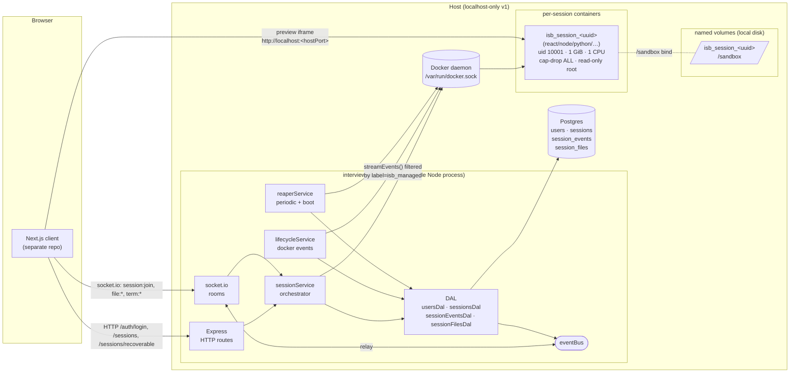
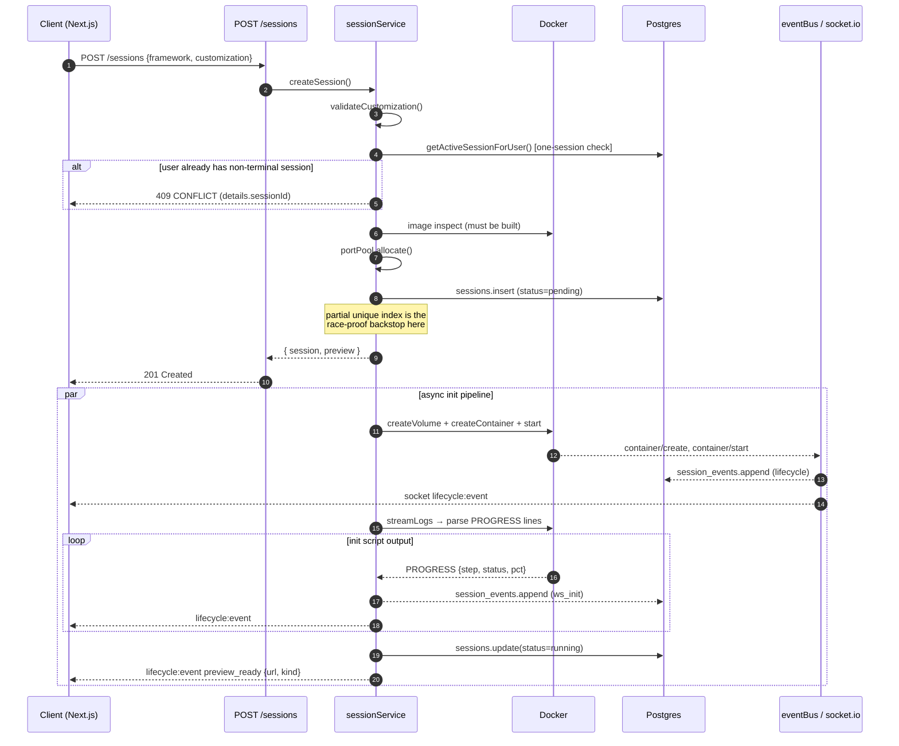
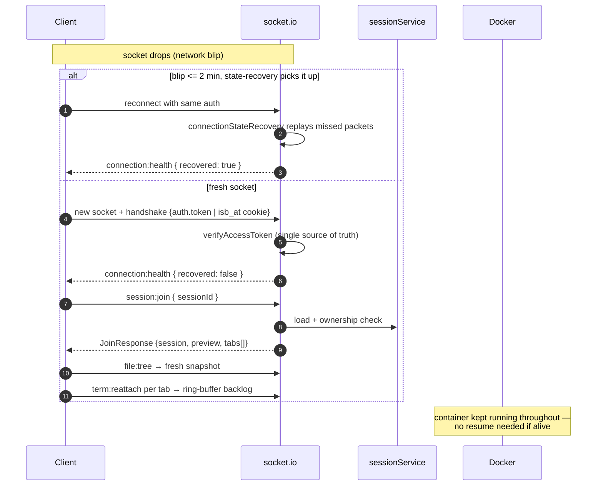
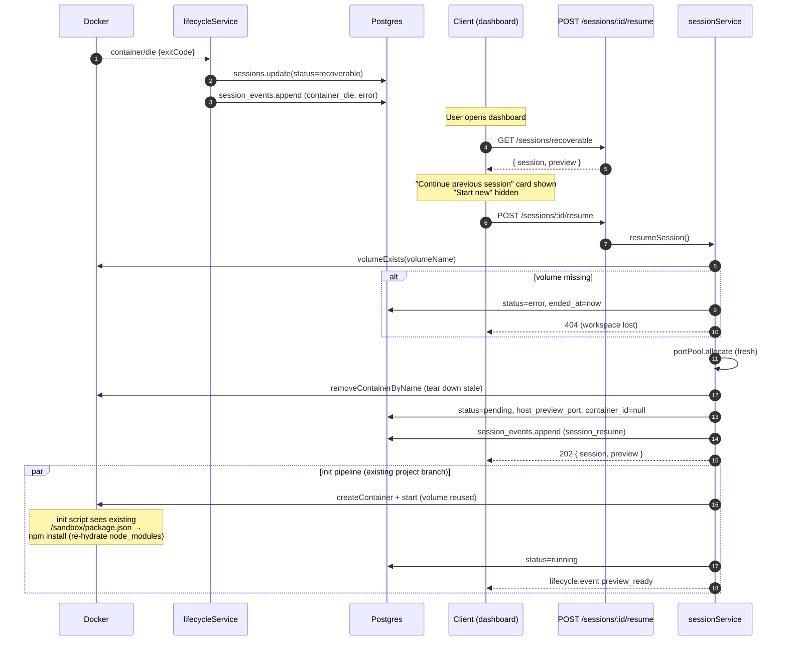
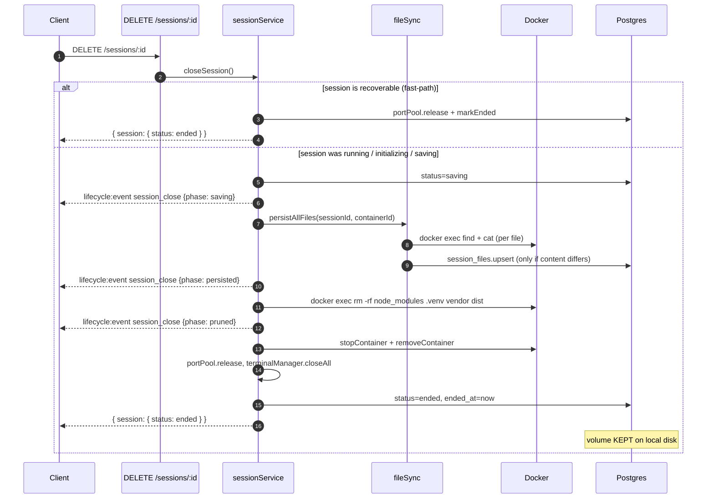

# Architecture — interview-sandbox-server

v1 deployment is single-host, localhost-only, ≤ 20 concurrent users. The system
is intentionally a single Node process per host, with all state on local
disk (Docker named volumes + Postgres).

## High-level topology



Key invariants:

- **All DB access goes through the DAL.** Services + routes + WS handlers
  never run raw SQL; one file per entity in `src/dal/`.
- **One room per session** (`session:<uuid>`) in socket.io. Lifecycle events
  + file/terminal pushes are emitted to the room; subscribers receive
  exactly the events for sessions they own.
- **Hard one-session rule** enforced at two levels: a partial unique index
  in Postgres (`sessions_one_active_per_user_uniq`), and the DAL
  pre-checking before insert.
- **No host bind mounts** — sandbox containers see only the per-session
  named volume + per-container tmpfs (`/tmp`, `~/.cache`, `~/.npm`).
- **Single-host today; decoupled-for-Redis** — the eventBus + room model
  are the only places that would need a Redis adapter to go multi-process.

---

## Critical paths

### Session create → init → running



### Reconnect (transient blip)



### Resume (prolonged loss → recoverable → rehydrate)



### Close (save → prune → release)



---

## Storage layout

```
Postgres:
  users
  sessions             ← container_id, volume_name, host_preview_port, status
  session_events       ← append-only audit log (relayed to room)
  session_files        ← durable source copy (excludes node_modules)

Local disk (named Docker volumes):
  /var/lib/docker/volumes/isb_session_<uuid>/_data
    ├── package.json          (source — durable)
    ├── src/…                 (source — durable)
    ├── vite.config.js         (source — durable)
    └── node_modules/         (heavy — pruned on close, re-installed on resume)
```

Excluded from the durable `session_files` copy: `node_modules`, `.venv`,
`vendor`, `.git`, `dist`, `build`, `.next`. The container still has them;
we just don't persist them in Postgres.

---

## Failure-mode map

| Failure | Detection | Response |
|---|---|---|
| Bad login | bcrypt verify in `services/auth.ts` | 401 `UNAUTHORIZED`, rate-limited 5×/min |
| Expired access token | `verifyAccessToken` throws | 401 — client refreshes + re-handshakes |
| API down | client `fetch` rejects | client shows banner, retries with backoff |
| Socket drop | `disconnect` event | state-recovery (2 min) or fresh handshake; `connection:health` event |
| Container start failure | `runInitPipeline` catch | `cleanupFailedInit` removes container/volume, releases port, status=error |
| Init script failure | `PROGRESS … "status":"error"` | same as above; error message bubbles to `session_events` |
| Container OOM / crash mid-session | `lifecycleService` `die`/`oom` events | status=recoverable, port released; user can resume |
| Preview not ready | session status != `running` | client polls `GET /sessions/:id` until ready, shows loader |
| Save failure during close | `persistAllFiles` catches, logs | proceed to ended; warn event in audit log |
| One-session conflict | DAL pre-check + partial unique index | 409 with `details.sessionId` — client shows recoverable card |
| Port exhausted | `portPool.allocate() === null` | 409 `CONFLICT` "No free preview ports — please retry shortly" |
| Volume missing on resume | `volumeExists` returns false | 404, session force-ended, clear error |
| Container ↔ DB drift | `reaperService.reconcile` at boot | non-terminal sessions without containers → recoverable; orphan containers removed |

---

## Concurrency budget

Per-container resource caps × 20 concurrent containers:

| Resource | Per container | × 20 | Comfortable on |
|---|---|---|---|
| Memory | 1 GiB | 20 GiB | 32 GiB host |
| CPU | 1 vCPU (soft) | 20 vCPU oversubscribed | 8+ cores |
| PIDs | 256 | 5120 | default 32k cap |
| Disk per volume | ~500 MB | ~10 GB | typical SSD |
| Host preview ports | 1 | 20 (of 100 pool) | trivially within range |

If a host can't sustain 20: drop `MAX_CONCURRENT_SESSIONS`; do not weaken
per-container caps. The runtime cap returns 409 with a clear reason when
exceeded.

---

## What changes on the way to cloud

Documented in `docker/README.md` under "Preview path (cloud)". The v1 → cloud
delta is **bounded** to two files:

1. `src/services/previewService.ts` — URL synthesis (subdomain instead of port)
2. `docker/` proxy config (nginx/Traefik with `Upgrade: $http_upgrade` for HMR WebSockets)

Everything else — orchestrator, WS layer, security flags, DAL — stays identical.
